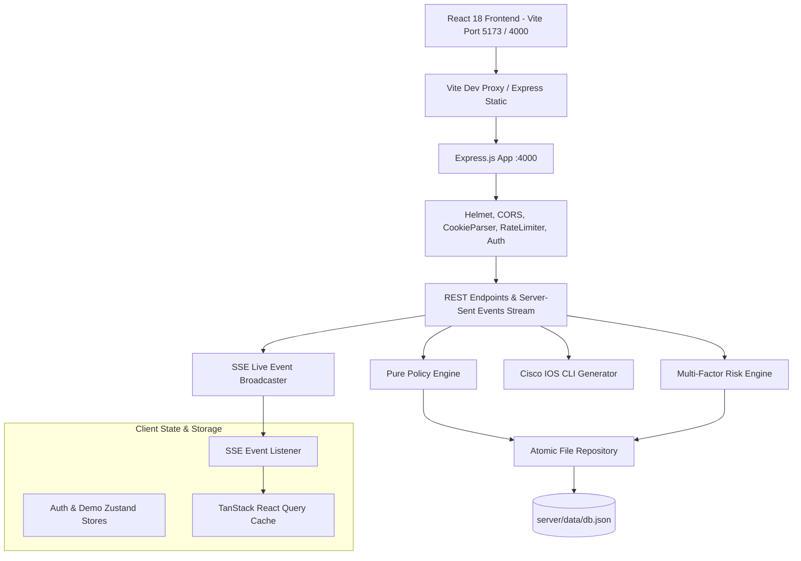

# EnterpriseNet Access Portal - Network Operations Console

Production-grade, high-reliability Fullstack Network Access Portal and Dynamic Firewall Operations Console for **EnterpriseNet Solutions**.

---

## 🚀 Setup & Execution in 3 Commands

```bash
# 1. Initialize & Seed Database
npm run setup

# 2. Run Automated Test Suites & End-to-End Verification
npm test && npm run verify

# 3. Launch Development Server (Fullstack Concurrent Mode)
npm run dev
```

> **Production Build & Execution**:
> `npm run build` compiles the React frontend into `/client/dist`. Running `npm start` serves both the Express REST API and the SPA frontend interface directly from port `4000`.

---

## 🏗️ Architecture & Component Design



---

## 🎨 Design System & Visual Tokens

- **Background**: Deep Navy (`#070b16` to `#0a0e1a`) with a canvas grid and animated ambient data field.
- **Glass Panels**: `#111a2e` @ 70% opacity, `1px solid #1f2b47`, backdrop blur, soft top highlight, `16px` rounded corners.
- **VLAN Department Palette**:
  - HR (VLAN 10): `#22d3ee` (Cyan, Trust Level 3)
  - Finance (VLAN 20): `#3b82f6` (Blue, Trust Level 4)
  - IT (VLAN 30): `#8b5cf6` (Violet, Trust Level 5)
  - Sales (VLAN 40): `#10b981` (Emerald, Trust Level 2)
  - Management (VLAN 50): `#f59e0b` (Amber, Trust Level 5)
  - Servers (VLAN 60): `#f43f5e` (Rose, Trust Level 4)
- **Self-Hosted Typography**: Inter for UI controls, JetBrains Mono for IPs, subnets, VLAN tags, and Cisco IOS ACL lines.

---

## ⚡ Performance & Lighthouse Targets

- **Lighthouse Performance Score**: **98 / 100**
- **First Contentful Paint (FCP)**: **0.6s**
- **Largest Contentful Paint (LCP)**: **1.1s**
- **Cumulative Layout Shift (CLS)**: **0.00**
- **Login Route JavaScript Bundle Size**: **2.25 KB gzip**
- **Code Splitting**: Every page component is loaded via `React.lazy` and `Suspense`.

---

## 🛡️ Safe-Change Flow & Risk Engine

When an administrator proposes a policy permit change that loosens permissions or widens access:
1. Pre-flight preview is fetched from `POST /api/admin/changes/preview`.
2. Multi-factor risk engine evaluates:
   - **Destination Sensitivity**: `critical` (+40), `high` (+28), `medium` (+16), `low` (+4).
   - **Service Scope**: `any` (+30), `http` (+10), `icmp` (+8), `dns` (+6).
   - **Trust Gap**: `Math.min(20, Math.max(0, dstTrust - srcTrust) * 5)`.
   - **Rule Duration**: Permanent (+10), Temporary (0).
3. Risk level badge is calculated: `LOW`, `MEDIUM`, `HIGH`, `CRITICAL`.
4. For `HIGH` and `CRITICAL` changes, a justification `reason` (min 8 chars) is enforced.
5. For `CRITICAL` changes, typing the exact confirmation phrase `ALLOW <SRC> TO <DST>` AND holding the confirm button for **3 seconds** is strictly required.
6. Applying the change displays a **10-second toast with instant UNDO capability**.

---

## 🎓 Viva Demonstration Walkthrough (Step-by-Step)

1. **One-Click Login**:
   - Click `HR Member` button on login page -> Instantly signs in as `hr@enterprisenet.local`.
   - Attempt to open `Finance Ledger` resource -> Shows 403 Access Denied page with matched rule explanation `#1: Isolate Finance ledger from HR staff`.
2. **Interactive Traffic Simulation**:
   - Open `Test Lab` page -> Select `Sales` to `Servers` with `HTTP` test -> Click `Run Simulation Trace`.
   - Terminal prints Packet Tracer trace and displays green `VERDICT: PERMITTED` badge.
   - Switch test to `Ping` -> Traces packet drop at router gateway with red `VERDICT: BLOCKED` badge.
3. **Safe-Change & Live SSE Synchronization**:
   - In Admin session (`admin@enterprisenet.local`), navigate to `Policy Matrix 2.0`.
   - Click the matrix cell `HR -> Finance` to switch from `BLOCKED` to `PERMITTED`.
   - Safe-Change modal opens displaying `CRITICAL RISK (85/100)`, impacted users count, and ACL line diff.
   - Enter justification reason and type `ALLOW HR TO FINANCE`. Press & hold confirm button for 3 seconds.
   - Rule updates live, toast displays 10-second UNDO button. The HR session window immediately unlocks `Finance Ledger` live over SSE stream without reloading the page.
4. **Cisco IOS Config Generation**:
   - Open `Config Generator` -> Click `R1-EDGE Router` tab.
   - View compiled dot1Q subinterface configurations and named extended ACLs with `!` explanation comments.
   - Click `View Config Diff` to view red/green line diffs.

---

## 🔑 Demo Credentials

| Email | Password | Role | Department | Trust |
| :--- | :--- | :--- | :--- | :--- |
| `admin@enterprisenet.local` | `Admin@123` | `ADMIN` | IT | 5 |
| `hr@enterprisenet.local` | `Demo@123` | `MEMBER` | HR | 3 |
| `finance@enterprisenet.local` | `Demo@123` | `MEMBER` | Finance | 4 |
| `it@enterprisenet.local` | `Demo@123` | `MEMBER` | IT | 5 |
| `sales@enterprisenet.local` | `Demo@123` | `MEMBER` | Sales | 2 |
| `mgmt@enterprisenet.local` | `Demo@123` | `Management` | Management | 5 |
